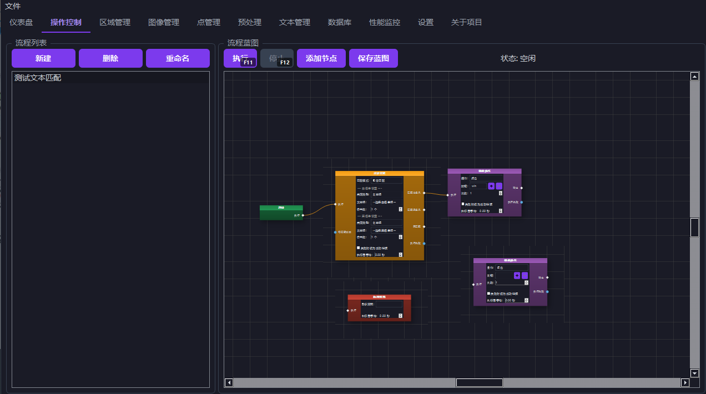
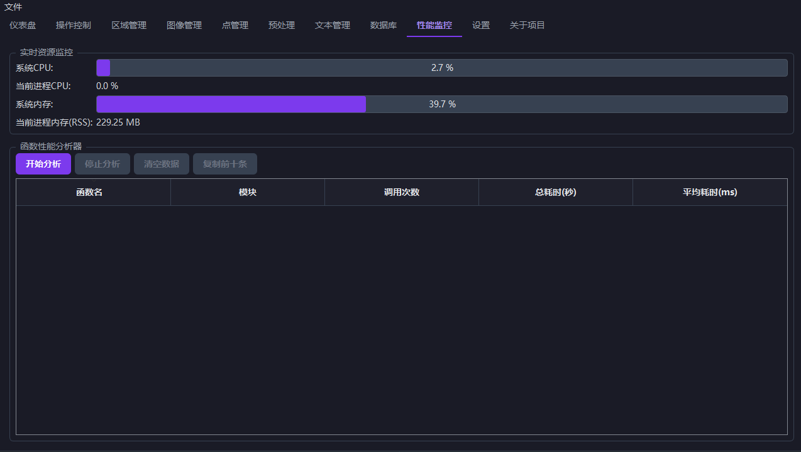

# 蓝图式键鼠控制器 - 官方主页

欢迎使用“蓝图式键鼠控制器”，一款强大的自动化键鼠操作工作流构建工具。

---

### 软件简介

“蓝图式键鼠控制器”致力于让普通用户也能轻松设计和执行复杂的自动化任务。我们借鉴了UE5（虚幻引擎5）中直观、强大的蓝图系统，让您可以通过拖拽和连接不同的功能模块，像搭积木一样“绘制”出您的自动化工作流程，而无需编写一行代码。

无论是批量处理重复性办公任务、自动执行游戏内操作，还是简化任何复杂的电脑操作，本软件都能为您提供稳定、高效的解决方案。

### 核心功能

*   **可视化蓝图编辑**：在一个直观的画布上，通过拖放节点并连接它们来创建您的工作流。
*   **无需编程基础**：完全的图形化操作，让您专注于逻辑本身，而非复杂的代码语法。
*   **丰富的节点库**：内置了包括鼠标点击、移动、键盘输入、延时、循环、条件判断等在内的多种功能节点，满足绝大多数自动化需求。
*   **高度灵活性**：支持创建复杂的嵌套逻辑和变量，让您的自动化流程像程序一样智能。
*   **一键执行**：设计完成后，一键启动，让软件为您完成繁琐的工作。

### 联系方式

如果您在使用过程中遇到任何问题，或有任何宝贵的建议，欢迎通过以下方式联系我：

*   **电子邮箱**: sdjybn@foxmail.com
*   **QQ**: 806025862

---

### 隐私政策

我们非常重视您的个人隐私和数据安全。本软件的隐私政策如下：

1.  **不收集个人信息**：本软件的主体功能完全在您的本地电脑运行，我们不会以任何方式主动收集、存储或上传您的任何个人身份信息（如姓名、账户）或您电脑上的任何文件数据。

2.  **支付验证信息**：为了向您提供高级功能，我们集成了支付功能。在您选择支付以获取高级功能时，我们的系统会进行如下操作：
    *   系统会生成一个临时的、匿名的、与您个人身份无关的订单号或支付ID。
    *   该订单号仅用于验证您的支付状态，以激活相应时长的授权。
    *   我们承诺，该订单号不包含任何可用于识别您个人身份的信息，且仅用于本次授权验证。授权到期后，相关记录会自动失效或清除。

3.  **数据安全**：我们承诺不会出售、共享或泄露任何与支付验证相关的信息给任何第三方。所有验证流程均通过加密信道进行，以确保您的数据安全。

感谢您的信任与使用。
